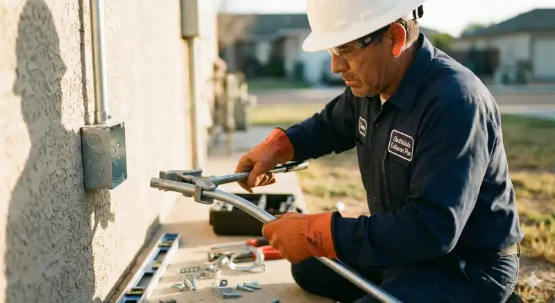

# Copiar Colonia (plomero -> electricista)

## Objetivo
Crear paginas de colonias para electricista usando la estructura EXACTA de plomero.
Solo cambia el contenido (textos, telefonos, URLs). Estructura HTML/CSS identica.

## Rutas base

PLOMERO (fuente):
/Users/hectorpc/Documents/Hector Palazuelos/Google My Business/plomero culiacan pro/servicios/plomero-colonias-culiacan/{colonia}/index.html

ELECTRICISTA (destino):
/Users/hectorpc/Documents/Hector Palazuelos/Google My Business/electricista culiacan pro/servicios/electricista-colonias-culiacan/{colonia}/index.html

## CSS CORRECTO (CRITICO)

<!-- USAR SIEMPRE - archivo en raiz -->
<link rel="stylesheet" href="../../../styles.min.css">

## Hero Image CORRECTO (CRITICO)

<picture class="hero-background">
  <source type="image/webp" srcset="../../../assets/images/optimizadas/hero-electricista-culiacan-500w.webp 500w,../../../assets/images/optimizadas/hero-electricista-culiacan-800w.webp 800w,../../../assets/images/optimizadas/hero-electricista-culiacan-1200w.webp 1200w" sizes="100vw">
  
</picture>

IMPORTANTE: El nombre es "hero-electricista-culiacan-" NO "electricista-culiacan-hero-"

## Logo CORRECTO

## Reemplazos obligatorios

# Marca
- "Plomero" -> "Electricista"
- "plomero" -> "electricista"
- "plomeria" -> "electricidad"
- "Plomeria" -> "Electricidad"

# Telefono
- "667 120 5864" -> "667 392 2273"
- "6671205864" -> "6673922273"
- "526671205864" -> "526673922273"

# Dominio
- "plomeroculiacanpro.mx" -> "electricistaculiacanpro.mx"

# GTM
- GTM-XXXXXX -> GTM-W75CRTX5

# URLs servicios
- "/servicios/emergencias-plomeria/" -> "/servicios/emergencia-24-7/"
- "/servicios/reparacion-fugas/" -> "/servicios/reparacion-cortos-circuitos/"
- "/servicios/destape-drenajes/" -> "/servicios/instalacion-contactos/"
- "/servicios/instalacion-tinacos/" -> "/servicios/mantenimiento-tableros/"

## Caja naranja hero (servicios principales)

  

    <strong>Servicios principales:</strong>
    <a href="/servicios/emergencia-24-7/" style="color:#E36414;">Emergencias 24/7</a>,
    <a href="/servicios/reparacion-cortos-circuitos/" style="color:#E36414;">reparación de cortocircuitos</a>,
    <a href="/servicios/instalacion-contactos/" style="color:#E36414;">instalación de contactos</a> y
    <a href="/servicios/mantenimiento-tableros/" style="color:#E36414;">tableros eléctricos</a>.
  

## Benefits grid (emojis)

  

🏠
<h3>Conocemos la Zona</h3>
Experiencia en el fraccionamiento

  

⚡
<h3>Llegada Rápida</h3>
Respuesta en 20-30 min

  

💰
<h3>Precios Justos</h3>
Sin sorpresas

  

🔧
<h3>Trabajo Garantizado</h3>
Garantía 6 meses

  

✅
<h3>Profesionales</h3>
Electricistas certificados

Nota: Para zona comercial (Centro), usar 🏢 en vez de 🏠

## Servicios cards

  
<h3>Instalación Eléctrica</h3>
Instalaciones completas para casas y negocios. Cableado y tierra física.

  
<h3>Reparación de Cortocircuitos</h3>
Detección y reparación de cortocircuitos, fallas y apagones.

  
<h3>Contactos y Apagadores</h3>
Instalación de contactos polarizados, apagadores y dimmers.

  
<h3>Tableros Eléctricos</h3>
Revisión, actualización y cambio de breakers.

  
<h3>Iluminación</h3>
Instalación de lámparas, spots LED y sistemas de iluminación.

  
<h3>Emergencias 24/7</h3>
Atención inmediata para emergencias eléctricas.

## Flujo de ejecucion

1. Recibir nombre de colonia
2. Verificar que existe en plomero
3. Crear directorio en electricista
4. Leer pagina de plomero
5. Aplicar TODOS los reemplazos
6. Asegurar:
   - CSS: ../../../styles.min.css
   - Hero: hero-electricista-culiacan-*.webp (NO electricista-culiacan-hero-*)
   - Rutas relativas: ../../../assets/images/...
7. Guardar en electricista
8. Abrir en navegador

## CHECKLIST FINAL

- [ ] CSS: href="../../../styles.min.css"
- [ ] Hero: hero-electricista-culiacan-*.webp
- [ ] srcset con rutas relativas ../../../
- [ ] Telefono: 667 392 2273
- [ ] WhatsApp: 526673922273
- [ ] Dominio: electricistaculiacanpro.mx
- [ ] Logo: electricista-culiacan-pro-logo.webp
- [ ] Sin menciones a plomero/plomeria
- [ ] Servicios de electricista
- [ ] Canonical URL correcta

## Pagina de referencia

Ver: /servicios/electricista-colonias-culiacan/las-quintas/index.html
Esta pagina esta 100% correcta y funcional.
