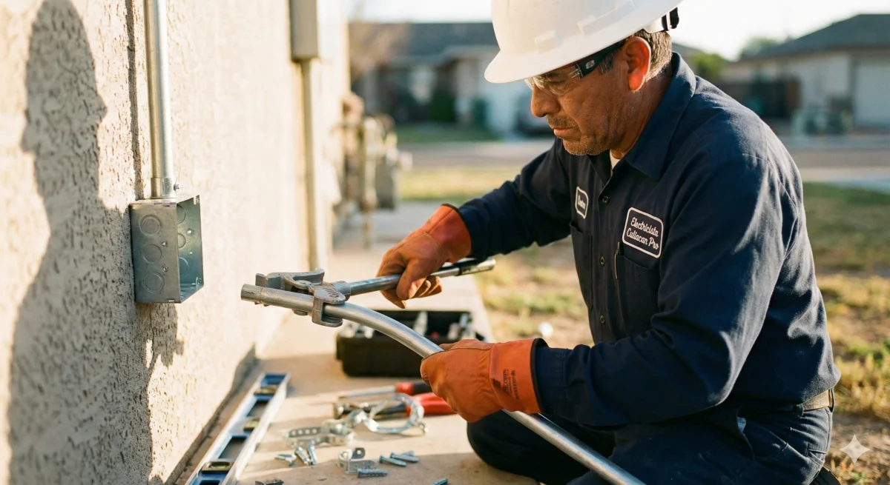

# Formato obligatorio para crear nuevas URLs (Electricista Culiacán Pro)

Este documento es **la norma** para publicar cualquier landing o artículo dentro del dominio. Todo punto marcado como "Obligatorio" debe cumplirse al 100 %. Si alguna sección falta o se altera la jerarquía, la URL **no se aprueba para despliegue**.

---

## 1. Objetivo y alcance
- Aplica a **todas** las páginas de servicio, colonias, precios, artículos SEO y micrositios que vivan en `/servicios/`, `/blog/`, `/contacto/` u otras rutas internas.
- Su propósito es preservar: identidad visual (Inter/Montserrat), promesa de llegada 30‑60 min, cobertura por colonias de Culiacán, datos de contacto visibles y performance equivalente al homepage.

---

## 2. Principios de marca y UX
1. **Tipografía**: solo `Inter` (texto) e `Montserrat` (encabezados) desde `assets/fonts/`. Ninguna otra familia es aceptada.
2. **Paleta**: primario `#1E40AF` (azul eléctrico), secundarios `#3B82F6`, `#FCD34D` (amarillo energía), fondos claros `#F8FAFC`. No crear colores nuevos sin aprobación.
3. **Voz**: profesional, confiable, centrada en Culiacán. Debe mencionar colonias específicas (Las Quintas, Tres Ríos, Chapultepec, Centro, etc.) y tiempos de llegada.
4. **Confianza**: mínimo una mención a garantía por escrito, certificación eléctrica, facturación SAT y soporte por WhatsApp. Uso moderado de emojis (máx. uno por bloque, preferir ⚡🔌💡).

---

## 3. Plano obligatorio de la página
Sigue la secuencia exacta. Cada bloque debe ir delimitado por `<section>` (o la etiqueta semántica indicada) y encabezado correcto (`h1` único, luego `h2` → `h3`).

### 3.0 Nav + Header (obligatorio)
**TODAS las páginas deben tener el MISMO nav + header de la homepage** (`https://electricistaculiacanpro.mx/`).

**Instrucción:** Copiar COMPLETO desde `<nav class="nav">` hasta `</header>` de index.html, cambiando ÚNICAMENTE el H1 y subtítulo según el tema de la página.

El resto (badge 5.0/5, imagen hero, contacto, CTA, estructura completa) debe ser **idéntico** a la homepage.

**NO crear headers minimalistas o compactos. Usar el header COMPLETO de la homepage.**

**Estructura EXACTA del Header (líneas 344-430 de index.html):**

```html
<header class="hero" id="inicio">
    <picture class="hero-background">
        <source type="image/webp"
                srcset="assets/images/optimizadas/hero-electricista-culiacan-800w.webp 800w,
                        assets/images/optimizadas/hero-electricista-culiacan-1200w.webp 1200w"
                sizes="100vw">
        
    </picture>

    <div class="container">
        <div class="hero-content">
            <h1 class="fade-in">TÍTULO DE LA PÁGINA</h1>

            <p class="hero-subtitle fade-in">SUBTÍTULO DESCRIPTIVO</p>

            <!-- Rating Badge Visible con Logo Google -->
            <div class="hero-rating fade-in">
                <svg class="google-logo" viewBox="0 0 24 24" xmlns="http://www.w3.org/2000/svg">
                    <path fill="#4285F4" d="M22.56 12.25c0-.78-.07-1.53-.2-2.25H12v4.26h5.92c-.26 1.37-1.04 2.53-2.21 3.31v2.77h3.57c2.08-1.92 3.28-4.74 3.28-8.09z"/>
                    <path fill="#34A853" d="M12 23c2.97 0 5.46-.98 7.28-2.66l-3.57-2.77c-.98.66-2.23 1.06-3.71 1.06-2.86 0-5.29-1.93-6.16-4.53H2.18v2.84C3.99 20.53 7.7 23 12 23z"/>
                    <path fill="#FBBC05" d="M5.84 14.09c-.22-.66-.35-1.36-.35-2.09s.13-1.43.35-2.09V7.07H2.18C1.43 8.55 1 10.22 1 12s.43 3.45 1.18 4.93l2.85-2.22.81-.62z"/>
                    <path fill="#EA4335" d="M12 5.38c1.62 0 3.06.56 4.21 1.64l3.15-3.15C17.45 2.09 14.97 1 12 1 7.7 1 3.99 3.47 2.18 7.07l3.66 2.84c.87-2.6 3.3-4.53 6.16-4.53z"/>
                </svg>
                <span class="rating-stars">★★★★★</span>
                <span class="rating-score">5.0/5</span>
                <span class="rating-divider">·</span>
                <span class="rating-count">Más de 50 clientes satisfechos en Culiacán</span>
            </div>

            <!-- Feature List con Iconografía -->
            <div class="hero-features fade-in">
                <div class="feature-item">
                    <svg class="feature-icon" viewBox="0 0 24 24" fill="none" stroke="currentColor" stroke-width="2" stroke-linecap="round" stroke-linejoin="round">
                        <circle cx="12" cy="12" r="10"/>
                        <polyline points="12 6 12 12 16 14"/>
                    </svg>
                    <span>Llegamos en 30-60 min</span>
                </div>
                <div class="feature-item">
                    <svg class="feature-icon" viewBox="0 0 24 24" fill="none" stroke="currentColor" stroke-width="2" stroke-linecap="round" stroke-linejoin="round">
                        <path d="M12 22s8-4 8-10V5l-8-3-8 3v7c0 6 8 10 8 10z"/>
                    </svg>
                    <span>Garantía por escrito</span>
                </div>
                <div class="feature-item">
                    <svg class="feature-icon" viewBox="0 0 24 24" fill="none" stroke="currentColor" stroke-width="2" stroke-linecap="round" stroke-linejoin="round">
                        <path d="M14 2H6a2 2 0 0 0-2 2v16a2 2 0 0 0 2 2h12a2 2 0 0 0 2-2V8z"/>
                        <polyline points="14 2 14 8 20 8"/>
                        <line x1="16" y1="13" x2="8" y2="13"/>
                        <line x1="16" y1="17" x2="8" y2="17"/>
                        <polyline points="10 9 9 9 8 9"/>
                    </svg>
                    <span>Factura disponible</span>
                </div>
            </div>

            <a href="#contacto" class="btn-primary hover-lift">Solicitar Atención Inmediata</a>
        </div>
    </div>
</header>
```

**Elementos obligatorios:**
1. ✅ Clase `hero` e `id="inicio"` en header
2. ✅ Picture con clase `hero-background` para LCP optimization
3. ✅ Logo Google SVG con 4 paths de colores (#4285F4, #34A853, #FBBC05, #EA4335)
4. ✅ Rating badge con "5.0/5 · Más de 50 clientes satisfechos en Culiacán"
5. ✅ 3 feature items con SVGs completos (reloj, escudo, factura)
6. ✅ Clase `fade-in` en h1, subtitle, rating y features
7. ✅ Botón CTA con clases `btn-primary hover-lift`
8. ✅ Container > hero-content structure

**Solo personalizar por página:**
- H1 (título específico de la página)
- hero-subtitle (subtítulo descriptivo)
- Ruta de imagen hero (mantener estructura srcset)
- Texto del botón CTA (puede ser: "Solicitar Atención Inmediata", "Solicitar Revisión", "Solicitar Asesoría", etc.)
- Alt text de la imagen (debe incluir acción + servicio + Culiacán)

**NO modificar:**
- Estructura del rating badge
- Logo de Google (debe tener los 4 paths completos con colores exactos)
- Feature items (siempre los mismos 3 con sus SVGs)
- Rating "5.0/5" y texto "Más de 50 clientes satisfechos"
- Clases CSS (hero, hero-background, hero-content, hero-rating, hero-features, fade-in, etc.)

### 3.1 Head SEO (obligatorio)
- `<title>` = `Servicio + en Culiacán | Beneficio directo`. Ej.: "Instalación Eléctrica en Culiacán | Llegada 30‑60 min".
- `<meta name="description">` con urgencia + cobertura + contacto (tel/WhatsApp).
- `lang="es-MX"` en `<html>`.
- `<link rel="canonical">` hacia la URL final (sin parámetros).
- OG/Twitter replican título, descripción e imagen hero (`https://electricistaculiacanpro.mx/assets/...`).
- Preloads exactos:
  ```html
  <link rel="preload" href="/assets/fonts/inter-400.woff2" ...>
  <link rel="preload" href="/assets/fonts/montserrat-800.woff2" ...>
  ```
  (Se rechaza cualquier preload a rutas inexistentes).

### 3.2 JSON-LD (obligatorio)
Incluir un bloque `<script type="application/ld+json">` con `@graph` que contenga:
1. `WebSite`
2. `BreadcrumbList`
3. `Electrician` (NAP, `aggregateRating`, `priceRange`, `areaServed`, `sameAs`)
4. `Service` específico (nombre = servicio, `serviceType`, `areaServed` Culiacán, `provider` apuntando al negocio)
5. `FAQPage` si la página incluye preguntas (mín. 8).
La ausencia de cualquiera de estos nodos se considera falla crítica.

### 3.3 Hero (obligatorio)
- `<section id="inicio" class="hero">` con estructura:
  - `h1` con keyword exacta + promesa ("Electricista 24/7 en Culiacán – Emergencias en 30‑60 min").
  - Subtítulo describiendo problemas eléctricos comunes y colonias.
  - Bloque de contacto textual (Tel / WhatsApp) y CTA principal (`<a class="btn-primary">`).
  - **Badge visible**: `★★★★★ 5.0/5 (50+ reseñas verificadas)`.
  - Imagen hero:
    ```html
    <picture>
      <source type="image/webp" srcset="/assets/images/...-800w.webp 800w, ...-1200w.webp 1200w">
      
    </picture>
    ```
  - Si falta cualquiera de estos elementos (imagen, badge, CTA, contacto), la página no pasa QA.

### 3.4 Bloque de beneficios (obligatorio)
- Grid 4‑5 tarjetas (`.benefits-grid .benefit`): icono, `h3`, texto de 2‑3 líneas y lista con 2 bullets.
- Debe cubrir: llegada el mismo día, precios claros, garantía por escrito, certificación CFE, facturación, soporte WhatsApp.
- Iconografía eléctrica: ⚡ (rayo), 🔌 (enchufe), 💡 (bombilla), ⚙️ (tablero), 🛡️ (seguridad).

### 3.5 Sección "Nuestros servicios" (obligatorio)
- Mínimo 4 cards `<a class="card card--img">` enlazando a servicios relacionados.
- Cada card incluye `<picture>` con `srcset` WebP, `width/height`, `loading="lazy"`, `decoding="async"` y `alt` con acción + servicio + ubicación.
- Texto: título (h3), párrafo descriptivo y lista de 2 bullets.
- Servicios típicos: Instalación eléctrica, Reparación de cortocircuitos, Instalación de contactos, Mantenimiento de tableros, Iluminación LED, Emergencias 24/7.

### 3.6 CTA de emergencias (obligatorio)
- Bloque diferenciado (fondo alterno azul/amarillo) con copy directo ("Apaga el breaker principal…", "¿Cortocircuito? Te ayudamos YA") y botón a WhatsApp con `target="_blank"`.
- Énfasis en seguridad eléctrica y rapidez de respuesta.

### 3.7 Links SEO / interlinking (obligatorio)
- Grid `.seo-links` con al menos 5 `.seo-card` apuntando a las landings clave.
- Cada tarjeta debe tener `data-card-name`, `data-card-position` y CTA textual.
- Enlaces sugeridos: servicios por tipo, servicios por colonia, precios, emergencias.

### 3.8 Zonas de servicio (obligatorio)
- Sección enumerando colonias (mín. 8 nombres) + invitación a escribir si la colonia no aparece.
- Colonias prioritarias Culiacán: Las Quintas, Tres Ríos, Centro, Chapultepec, Montebello, Guadalupe, Campestre, Santa Fe, Zona Dorada, Villa Universidad, etc.

### 3.9 Testimonios (obligatorio)
- Mínimo 3 testimonios con:
  - Texto de cliente
  - Nombre + colonia en `<cite>`
  - Mención de servicio realizado (instalación, reparación, emergencia, etc.)
  - Énfasis en rapidez, profesionalismo y seguridad

### 3.10 Preguntas frecuentes (obligatorio)
- Mínimo 8 preguntas/respuestas únicas, enfocadas en:
  - Tiempos de llegada
  - Costos y cotizaciones
  - Cobertura de colonias
  - Garantías de trabajos
  - Certificaciones eléctricas
  - Seguridad y normativas CFE
  - Materiales utilizados
  - Emergencias eléctricas
- Deben coincidir con el JSON-LD `FAQPage`. Evita duplicar copy entre preguntas.

### 3.11 Contacto, formulario y mapa (obligatorio)
- Bloque con NAP completo: Tel, WhatsApp (link), correo, horarios (24/7), cobertura.
- Formulario idéntico al de la home: `#contact-form` con inputs `nombre`, `telefono`, `email`, `mensaje`.
- Debe incluir fallback server-side o instrucciones para captura (si no existe, anotar en ticket).
- Iframe de Google Maps con `title` y lista de colonias inmediatamente debajo.

### 3.12 Footer, mini-nav y scripts (obligatorio)
- Footer con aviso de derechos + tagline "Servicio profesional de electricidad en Culiacán, Sinaloa".
- Mini nav adicional con enlaces a Inicio, servicios clave, blog, contacto.
- Scripts:
  1. Toggle menú móvil
  2. Envío de formulario → WhatsApp (si aplica)
  3. CTA flotante (WhatsApp + Llamar) con `dataLayer` events
  4. Tracking de tarjetas SEO (click)
  5. Scroll Depth
  Todos dentro de IIFEs, sin variables globales. GTM debe cargarse aun sin `requestIdleCallback` (usa fallback con `setTimeout`).

---

## 4. Estándares de imágenes y assets
| Elemento | Requisitos |
| --- | --- |
| Hero | WebP 1200×800, `fetchpriority="high"`, `loading="eager"`, `alt` = "Electricista … en Culiacán …" |
| Cards | WebP 420/800, `width`/`height`, `loading="lazy"`, `decoding="async"` |
| OG/Twitter | Ruta absoluta `https://electricistaculiacanpro.mx/assets/images/...-800w.webp` |
| Renombrado | Usa nombres semánticos (`electricista-instalacion-contactos-culiacan.webp`). |
| Alt text | Formato: `Acción + servicio + ubicación`, ej. "Electricista instalando tablero eléctrico en Las Quintas Culiacán con certificación CFE". |

No se aprueban páginas sin imágenes ni con rutas relativas en OG/Twitter.

**Imágenes sugeridas por servicio:**
- Instalación eléctrica: técnico cableando, tablero nuevo
- Reparación cortocircuitos: técnico con multímetro, cables expuestos
- Instalación contactos: manos instalando enchufe
- Iluminación: instalación de lámparas LED, spots
- Emergencias: camioneta con logo, técnico llegando de noche
- Tableros: centro de carga abierto, breakers organizados

---

## 5. Copywriting y SEO
1. **Keywords principales**: "electricista en Culiacán", "servicio + Culiacán", "electricista 24/7 Culiacán", "instalación eléctrica Culiacán".
2. **Secundarias**: tiempos de llegada, diagnóstico, garantía, certificación CFE, facturación SAT, nombres de colonias, emergencias eléctricas, cortocircuitos, tableros.
3. **Encabezados**:
   - 1× `h1`
   - `h2` para cada bloque mayor (Beneficios, Servicios, Precios, FAQ, Contacto)
   - `h3` para subtemas/testimonios/preguntas.
4. **Enlaces internos**: usar anchors descriptivos ("Ver precios completos de electricidad en Culiacán", "Instalación eléctrica residencial") hacia otras landings/blog.
5. **CTA**: repetir tel/WhatsApp en hero, CTA emergencia, testimonios y footer.
6. **Localización**: menciona colonias distintas en hero, beneficios, CTA y FAQs. No repetir siempre las mismas 3.
7. **Terminología técnica correcta**: usar términos como "tablero eléctrico", "centro de carga", "breaker", "contacto polarizado", "instalación trifásica", "tierra física", "CFE", etc.

---

## 6. Performance, accesibilidad y tracking
- Nada de CSS inline extenso; define estilos en `styles.css`. Solo se permiten ajustes mínimos (<3 reglas) cuando sea imposible evitarlo.
- JS crítico debe tener fallback; GTM no puede depender solo de `requestIdleCallback`.
- Verifica contraste AA (azul #1E40AF sobre blanco = 8.59:1 ✅), botones ≥ 48px de alto, y atributos `aria-label` en CTA flotante.
- La página debe cargar fonts, imágenes y scripts desde HTTPS y rutas existentes (auditar 404).
- Usar `theme-color` azul: `#1E40AF` en manifest.json y meta tag.

---

## 7. Checklist QA antes de publicar
1. [ ] Actualicé `sitemaps/main_sitemap.xml` con la nueva URL y `lastmod` real (ISO 8601).
2. [ ] Validé el JSON-LD completo en Rich Results (sin warnings críticos).
3. [ ] Corrí Lighthouse (Desktop/Mobile) y obtuve LCP < 2.5 s, CLS < 0.1.
4. [ ] Probé formulario y CTAs con y sin JS (al menos verificar apertura de WhatsApp/teléfono).
5. [ ] Revisé ortografía y acentos ("electricidad", "Culiacán", "eléctrico").
6. [ ] Añadí anotación en GA4/Search Console con la fecha de publicación.
7. [ ] Confirmé que la página enlaza a las landings clave y desde ellas se regresa.
8. [ ] Verifiqué que no haya contenido duplicado con sitio de plomero.
9. [ ] Revisé que la terminología sea específica de electricidad (NO mencionar plomería).
10. [ ] Validé que los colores sean azul/amarillo (NO naranja).

**Ninguna URL se libera si un punto del checklist queda sin marcar.**

---

## 8. Diferencias clave vs. Plomero Culiacán Pro

### Colores
- ❌ NO usar naranja (#E36414, #F97316, #C2410C)
- ✅ SÍ usar azul (#1E40AF, #3B82F6, #1E3A8A) y amarillo (#FCD34D)

### Terminología
- ❌ NO: plomero, plomería, fugas, drenaje, sanitarios, boiler
- ✅ SÍ: electricista, electricidad, cortocircuitos, cableado, contactos, tableros, iluminación

### Iconografía
- ❌ NO: 🔧💧🚿
- ✅ SÍ: ⚡🔌💡⚙️🛡️

### Servicios
- ❌ NO: Destape de drenajes, Reparación de fugas, Instalación de sanitarios
- ✅ SÍ: Instalación eléctrica, Reparación de cortocircuitos, Instalación de contactos, Mantenimiento de tableros

### Schema.org
- ❌ NO: `@type: "Plumber"` o `"HomeAndConstructionBusiness"`
- ✅ SÍ: `@type: "Electrician"`

---

## 9. Servicios eléctricos principales (para referencia)

### Servicios residenciales
1. **Instalación eléctrica completa**
   - Cableado de casas nuevas
   - Actualización de instalaciones antiguas
   - Instalación de tierra física

2. **Reparación de cortocircuitos**
   - Detección de fallas eléctricas
   - Reparación de cables dañados
   - Solución de apagones parciales

3. **Instalación de contactos y apagadores**
   - Contactos polarizados
   - Contactos con tierra física
   - Apagadores de escalera
   - Dimmers

4. **Instalación de iluminación**
   - Lámparas LED
   - Focos ahorradores
   - Spots empotrados
   - Tiras LED
   - Ventiladores de techo

5. **Mantenimiento de tableros eléctricos**
   - Revisión de centros de carga
   - Cambio de breakers
   - Balanceo de cargas
   - Actualización de tableros

6. **Emergencias eléctricas 24/7**
   - Cortocircuitos urgentes
   - Apagones totales
   - Cables expuestos
   - Chispas en contactos
   - Olor a quemado

### Servicios comerciales
7. Instalación de sistemas trifásicos
8. Instalación de equipos de alto consumo
9. Cableado estructurado
10. Iluminación comercial
11. Sistemas de respaldo (UPS)

---

## 10. Colonias prioritarias de Culiacán

Para mencionar en textos y crear páginas específicas:

**Zona Norte:**
- Las Quintas
- Tres Ríos
- Country Tres Ríos
- Cumbres Tres Ríos
- Campestre
- Hacienda del Valle
- Hacienda Los Huertos

**Zona Centro:**
- Centro
- Guadalupe
- Chapultepec
- Santa Fe
- Zona Dorada

**Zona Sur:**
- Villa Universidad
- Montebello
- Villa Bonita
- Lomas del Boulevard
- Real del Valle

**Zona Oriente:**
- Colinas de San Miguel
- Lomas de San Isidro
- Nuevo Culiacán
- Infonavit Humaya

---

## 11. Registro de verificaciones (llenar por quien publica)
| Fecha | URL creada | Revisor | ¿Checklist completo? | Observaciones |
| --- | --- | --- | --- | --- |
| ____ | __________________________ | __________________ | Sí / No | __________________ |

Actualiza esta tabla cada vez que publiques para mantener trazabilidad.

---

## 12. Ejemplos de URLs correctas

### Servicios principales
- `/servicios/instalacion-electrica/`
- `/servicios/reparacion-cortocircuitos/`
- `/servicios/instalacion-contactos/`
- `/servicios/mantenimiento-tableros/`
- `/servicios/instalacion-iluminacion/`
- `/servicios/emergencia-24-7/`

### Servicios específicos
- `/servicios/electricista/a-domicilio/`
- `/servicios/electricista/cerca-de-mi/`
- `/servicios/electricista/precios/`
- `/servicios/instalacion-lamparas-led/`
- `/servicios/reparacion-apagones/`
- `/servicios/instalacion-tierra-fisica/`

### Por colonias
- `/servicios/electricista-colonias-culiacan/`
- `/servicios/electricista-colonias-culiacan/las-quintas/`
- `/servicios/electricista-colonias-culiacan/tres-rios/`
- `/servicios/electricista-colonias-culiacan/centro/`
- `/servicios/electricista-colonias-culiacan/chapultepec/`

### Blog (contenido SEO)
- `/blog/como-prevenir-cortocircuitos-casa/`
- `/blog/senales-instalacion-electrica-obsoleta/`
- `/blog/mantenimiento-tablero-electrico-preventivo/`
- `/blog/ahorro-energia-iluminacion-led/`
- `/blog/seguridad-electrica-temporada-lluvias/`

---

## 13. Plantilla de meta description

```
Electricista certificado en Culiacán · [Servicio específico] · Emergencia 24/7 con llegada en 30-60 min · Cobertura [2-3 colonias] · WhatsApp inmediato · Factura disponible · Garantía por escrito
```

**Ejemplo:**
```
Electricista certificado en Culiacán · Instalación eléctrica residencial · Emergencia 24/7 con llegada en 30-60 min · Cobertura Las Quintas, Tres Ríos, Centro · WhatsApp inmediato · Factura disponible · Garantía por escrito
```

---

## 14. Notas finales

- Este formato garantiza consistencia de marca entre todas las páginas
- Mantener actualizado según evolucionen los estándares SEO y Web Core Vitals
- Cualquier desviación debe ser aprobada y documentada
- Priorizar siempre: conversión → confianza → SEO → diseño

**Versión:** 1.0
**Última actualización:** 21 de noviembre, 2025
**Mantenedor:** Equipo de desarrollo Electricista Culiacán Pro

---

✅ **Documento completado y listo para usar como referencia en todas las nuevas URLs**
